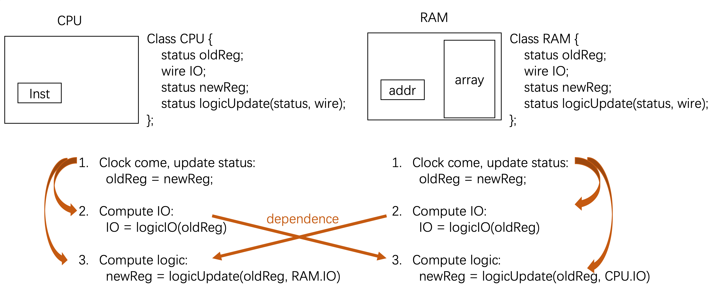

### Sep10, 2020 commit-82d9be1
This commit use `BoringUtils`  learnt from example [here](https://www.chisel-lang.org/api/latest/chisel3/util/experimental/BoringUtils$.html)

### Sep10, 2020 commit-743ce95
Set environment on [hubdocker](https://hub.docker.com/repository/docker/yuhengy/coredesign)

### Sep11, 2020 commit-9866e13
This commit learn verilator from this [tutorial](https://www.youtube.com/watch?v=HAQfD35U6-M) and this [document](https://www.veripool.org/projects/verilator/wiki/Documentation). And try a better Makefile refering to [NutShell](https://github.com/OSCPU/NutShell)

### Sep11, 2020 commit-ddcd040
This commit adds dependence chain graphs of files to clearly show the structure. This can be helpful for both understanding the code efficiently and keeping the big picture in mind throughout the project. The key insight from these graphs is that, they show the functionality of files/objects, i.e. **why we have these files**, which is benefited from a consice include/import, i.e. **staying away from redundant include/import, and of course, avoiding any declaration in .cpp**. 

### Sep12, 2020 commit-759988d
This commit adds a nemuResult class to abstract the trace from nemu-so. Also add a ram to load image file and send it to nemu-so. In future, this ram will also send data to verilator.
`riscv64-nemu-interpreter-so` is build through follow commands:
```shell
git clone https://github.com/OSCPU/nemu.git ${NEMU_HOME}
cd ${NEMU_HOME}
echo "nemu_ref: \$(DIFF_REF_SO)" >> Makefile
make DIFF=nemu ISA=riscv64 nemu_ref
cp ${NEMU_HOME}/build/riscv64-nemu-interpreter-so ${COREDESIGN_HOME}/verilator/diffLib
```
Learn `dlfcn.h` from `NutShell/src/test/csrc/difftest.cpp` and this [example](https://www.jianshu.com/p/72cc08405a5a).

### Sep12, 2020 commit-fa9843d
This commit use an alternative method to use sbt. This is better becuase old method must create new subproject whenever create a new dir.

### Sep13, 2020 commit-f793da0
This commit tests three functions:
+ `ram.cpp` feeds chisel data successfully.
+ Chisel write to regfile successfully.
+ Chisel boringUtils the regfile to `verilatorResult.cpp` successfully.

The test method is that we let the `mycorTOP.scala` keep reading the memory and writing it into regfile.
Note Scala does not support 0x80000000, and need use 0x80000000**L** instead.

### Sep13, 2020 commit-9532afa
This commit is the `instFetch` and `decode` stages. These are enough to formalize the codestyle even though this commit is untestable.
Much code is based on [soder](https://github.com/ucb-bar/riscv-sodor)'s 5-stage core and its structure plot is copied into ./documents/ for convenience.

CodeStyle: 
+ I use individual package for each of five stages. 
+ In each class (in each package), I also divide it into several subclasses with `//------begin------ //^^^^^^end^^^^^^`. These subclasses hold following abstractions:
	+ Subclasses named `${stageName} global status` is global to the whole class, i.e. all other subclass can read or write to it.
	+ Other subclasses have **Two Interface** (`//input` and `//output`) and their **Private Val**.
+ In each class, io.input is global to the whole class; while io.output is connected in a individual subclass for clear. 

### Sep14, 2020 commit-adf221a
This commit uses bundle as data/ctrl-io and add execute stage. Untestable.

As code scale up, we futher highlight the **Coding Principles** behind the **Code Style** listed above. Any other styles can be an alternative once they can achieve these principle.

Coding Principles:
+ Name Space (i.e. Visibility) Principle
	+ Whole Project: Only readonly configurations/constants are visible to the whole project.
	+ One file/class(~200 lines): all global value with in one file need to be **explicitly highlighted** by `include`, `import`, `io`, `notation`. These global values should be a trade-off between as few as possible, and as frequently used as possible. Also, this indicate that we should `include/import` as few as possible in order to be more specific.
	+ One function/subclass with `//------begin------ //^^^^^^end^^^^^^` (~20 lines): all local value need to be **highlighted** explicitly by `paramters`, `return`, `notation`, or implicitly by `val` declaration. This is achieved under the cost of more input/output codes.
	+ I suppose **this complex module interface** is intrinsic in hardware design contrary to software design. Chisel provides a cool method to solve it with `<>`, which provides an implicit connection between interfaces with a reasonable hint from `bundle` name. Further, [here](https://www.chisel-lang.org/api/latest/chisel3/Bundle.html) and [here](https://stackoverflow.com/questions/59049673/how-to-initialize-a-reg-of-bundle-in-chisel) provides an implicit connection between interfaces and regs without unbundling.
+ Other Principles for future

Besides, we formalized the Naming convention here.

Naming Convention:
+ One file, one class. File name is the same to the class name.
+ In most cases, use **littleCaseBeginUpCaseFollow** name for both class name or value name.
+ List all usage of `_`:
	+ Type name, use typeName_t, to avoid conflict in this situation: `typeName_t typeName` (instead of the conflict in `typeName typeName`).
	+ Class name, use className_t.
	+ Data wide, like PCSel_w.

### Sep14, 2020 commit-03c900c
This commit finishes memory and writeBack pipe-stages and integrate all five stages into mycoreTOP. Untested, but ready to test in next commit.

### Sep14, 2020 commit-ed6a367
**SIGNIFICANT** This commit works the first LUI instruction, and compared it with nemu. 

This commit dirtyly changes many files but they are all fixing bugs, Mainly these 2 bugs:
+ Partial assignment with `<>` is prohibited delibratedly to avoid subtle bugs.([here](https://github.com/freechipsproject/chisel3/issues/661) and [here](https://github.com/freechipsproject/www.chisel-lang.org/pull/48))
+ A bundle with direction (i.e., Input/Output) cannot be used to create a reg. See it by searching "Register myReg cannot be a bundle type with flips" in Google.

### Sep18, 2020 commit-da4ae93
This commit update the use of docker with `docker-compose` instead of old `docker run ...`.

Here, we explain the commands.
+ docker-compose up -d #For the first time
	1. create a container from image
	2. provision it with Dockerfile
	3. commit the container into a temp image
	4. provision it with docker-compose.yml
	5. run it at background
+ docker-compose exec my_env bash
	1. log into the container
+ docker-compose down --rmi all
	1. delete the container and the temp image
+ docker-compose down
	1. delete the container
	2. but the temp provisioned image remains
+ docker-compose up -d --build #after docker-compose down
	1. delete the old temp image
	2. redo docker-compose up -d as the first time
	3. With updated Dockerfile and updated docker-compose.yml, lose changes in the container
+ docker-compose up -d #after docker-compose down
	1. create a container from the temp image, even the Dockerfile may have changed
	2. provision it with docker-compose.yml
	3. run it at background
	4. With out-of-date Dockerfile and updated docker-compose.yml, lose changes in the container
+ docker-compose stop
	1. stop the container
+  docker-compose up -d
	1. rerun the container
	2. With out-of-date Dockerfile and updated docker-compose.yml, maintain changes in the container

Summary: Keep in mind we have:
+ original image
+ provisioned temp image
+ container booted from provisioned image
+ container that has been manually changed

These commands hold more complex logic compared with vagrant, becuase here we have provisioned images

### Sep18, 2020 commit-137718e
**Exciting Demo** This commit provides an **`one command from nothing`** method to setup docker enviornment,  run simulation, and cleanup everything with a single command. The only thing you need is docker and docker-compose(bounded with docker destop on Mac/Win). Then, run `sh run_from_nothing.sh`.

One thing to note is that,  non-interactive bash in `docker-compose exec my_env bash -c "..."` is quite difficult to use. And a non-trival `sed` is used to make it work.

### Sep26, 2020 commit-122f8ec
This commit adds a testbench-compile framework. As an example, a single LUI .S file is compiled and loaded into verilator to feed nemu and chiselcore.

+ How to strip out the elf info in a` .o` file? so that it can be run on bare core
	Generally, when we use `riscv64-linux-gnu-gcc -c ./testbench/singleLUI.S -o ./testbench/build/singleLUI.o`, the generated `.o` file is quite complex with much elf infomation. To strip them out, refering to [here](https://stackoverflow.com/questions/13132138/purest-way-to-assemble-compile-a-file-with-no-other-elf-object-bloat), use `riscv64-linux-gnu-objcopy -O binary ./testbench/build/singleLUI.o ./testbench/build/singleLUI.bin`, so that the generated `.bin` file is a single instruction.
	
### Sep27, 2020 commit-e94a5cd
This commit reorganizes the repo structure. A [parent repo](https://github.com/yuhengy/coredesign-env.git) is created to trace Dockerfile and dependence (i.e., nemu, riscv-gnu-toolchain). Also, the developLog is moved into ./documents and a new README is created.

### Sep27, 2020 commit-15dfd5e
This commit adds the framework to import official test ([repo riscv-tests](https://github.com/riscv/riscv-tests)) and run on chisel and nemu. For chisel, unimplemented instruction will rise assert error.

### Sep27, 2020 commit-2cb3ef7
This commit adds chisel pipeline stall. And correct step(1) for verilator, which means chisel commit 1 instruction instead of 1 clock cycle.

To implement stall, we use Decoupled(). To read this abstraction easier, we should remember Decoupled will change the Bundle into an **Output** direction, thus Output valid and Input ready. So, to make Bundle more connected with the Output direction, I move `*IO`s to the packages of the classes that Output these `*IO`s.

### Sep28, 2020 commit-9caae58
This commit adds JAL instruction. Which means, pipeline kill is implemented becuase meeting JAL at execute stage will kill the instruction in IF, DEC. Besides, there are two tricky part we solve:
+ How to make sure the first instruction at 0x80000000 get to the Decode stage with the `ifToDecCtrlIO.valid` signal.
+ It's convienient to use regFile and the commited PC updated it as the state for Chisel, while, nemu provides the regFIle and the new PC which is going to update it as the trace.

### Sep28, 2020 commit-1c9f590
This commit makes cpp verilator/nemuResult inherient from diffTestIO_c, which not only make main.cpp clearer, but also is consistent with the inherit in Chisel.

### Sep28, 2020 commit-58fa394
This commit implements ADDI. And, mask the `regCtrlIO` for each pipeline stage with the related `regIsUpdated`.

### Oct4, 2020 commit-2066159
This commit adds cputest from AM.

### Oct4, 2020 commit-c38b115
This commit passes AMCPUTest/dummy-riscv64-nutshell. And the vcd wave is dumped into `./build/generated-cpp/myVCD.vcd`

### Oct5, 2020 commit-110b0f0
This commit passes most AMCPUTest except mul/div.

### Oct12, 2020 commit-08618c7
This commit adds a better terminal output to tell you `Hit Good Trap` and can run many testbench with a single command. However, for now, all testbenches will be run anyway, even some of them fail, which make a harder to find the error.

### Oct12, 2020 commit-bfbad1b
This commit rewrite the part in `verilatorResult.cpp`, which deals with the interference between two logic modules(`verilatorTOP` and `ram`). To illustrate the process of cpp simulatioin of a logic module, the figure below shows the 3 steps and related dependency.



However, in verilator, the 3 steps for the CPU is wrapped into a single interface called eval(), in the sequence of **3-1-2**. So, we add three steps to evaluate RAM after the call of `verilatorTOP->eval()` and the dependency holds. Besides, becuase the update logic for RAM is very simple, `oldReg` and `newReg` could be the same data structure. But to keep the logic consistent, we still use two data structure.

### Oct14, 2020 commit-4c407c9
This commit makes sure chisel ram request will have 64bit aligned address.

### Oct15, 2020 commit-
This commit launch the test on pynq.

#### Environment setup:
+ in the docker, can run `ssh myUbuntu` to connect to a server with `vivado`2020.1
+ in the docker, can run `ssh myPynq` to connect to the root of pynq

#### Manual steps to launch the test on pynq, which is helpful to understand what makefile is doing:
+ Use vivado to create a block design and generate .bit and .hwh files
+ Copy .bit and .hwh(containing name information for python object) in to `myPynq:$(pynqProjectDir)/$(vivadoBitfileName)`
+ Copy the whole `coredesign` project to `myPynq:$(pynqProjectDir)/`
+ Run `fpga/runTest.py` to launch the test.

#### What is the vivado block design like?
+ submodules:
	+ A module to represent Arm processor on the pynq
	+ `fpgaTOP.v` generated from chisel
	+ Inst BRAM, Data BRAM
	+ A BRAM to buffer the PC trace
+ connections:
	+ `fpgaTOP.v` reset and hitGoodTrap is connected to Arm GPIO
	+ `fpgaTOP.v` is connected to BRAM, especially, PC is write to PCTrace BRAM when an instruction commits
	+ Inst BRAM, Data BRAM, PCTrace BRAM are connected to Arm AXI Master

#### How to redo the block design manually?
+ Run `make getVerilogFPGA` in `./` and get the fpgaTOP module at `./build/generated-verilog/fpgaTOP.v`
+ Create a vivado project manually and add the source `fpgaTOP.v`.
+ Run tcl command in vivado `source ./fpga/design_1.tcl`. This will recreate the block design. TODO: This is not enough, you need config the bram PORTB data width by connecting them with axi_bram_ctrl manually and automodify the data width (you cannot change the data width manually). pdf of Block design is saved in `./documents/vivadoBlockDesign.pdf`
+ Wrap the block design and generate bitstream. If your project name isproject_coredesign, you can find .bit at `./project_coredesign/project_coredesign.runs/impl_1/design_1_wrapper.bit` and .hwh at `./project_coredesign/project_coredesign.srcs/sources_1/bd/design_1/hw_handoff/design_1.hwh`

#### Where is the `./fpga/design_1.tcl` from? It seems to complex to be written manually.
+ I create a new block design in vivado and create modules with GUI. Then, vivado can export a tcl script percisely describing what I have done in the GUI.

#### What is the `runTest.py` doing?
+ Pynq framework gives us these useful API, to access BRAM, GPIO as an python object. (implemented as MMIO inside)
+ Thus, it's easy to use python to load image into InstBRAM, reset the Chisel CPU, check whether hitGoodTrap, and finally, dump the PC trace.
