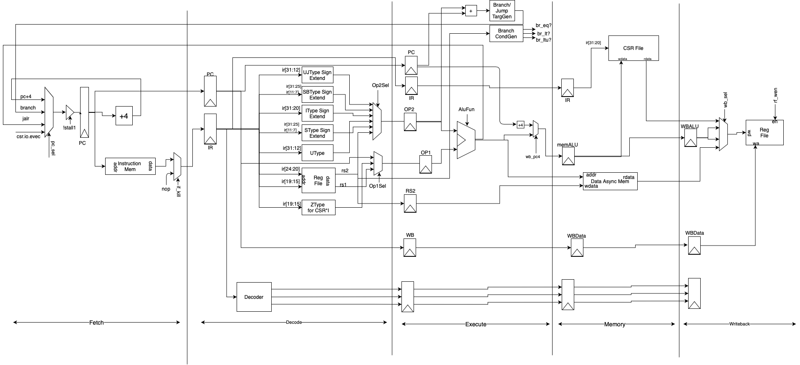
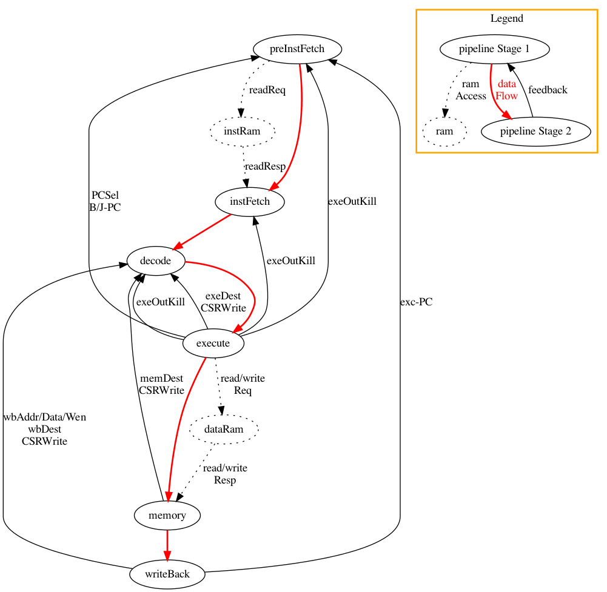
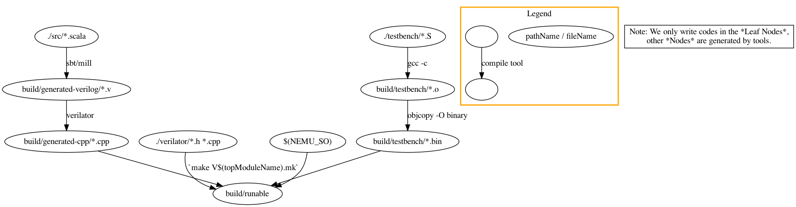
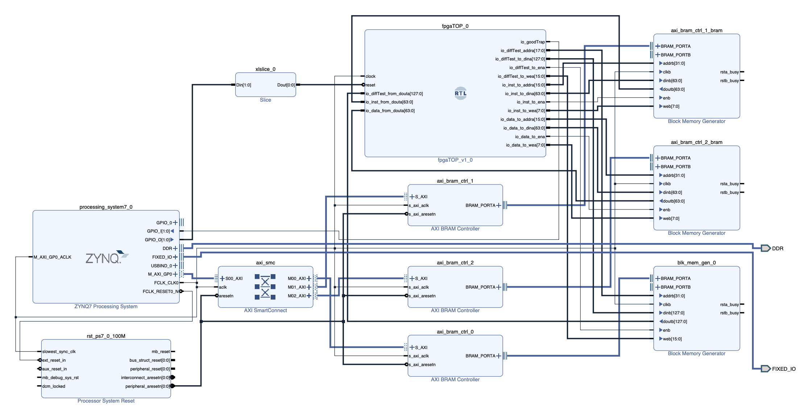
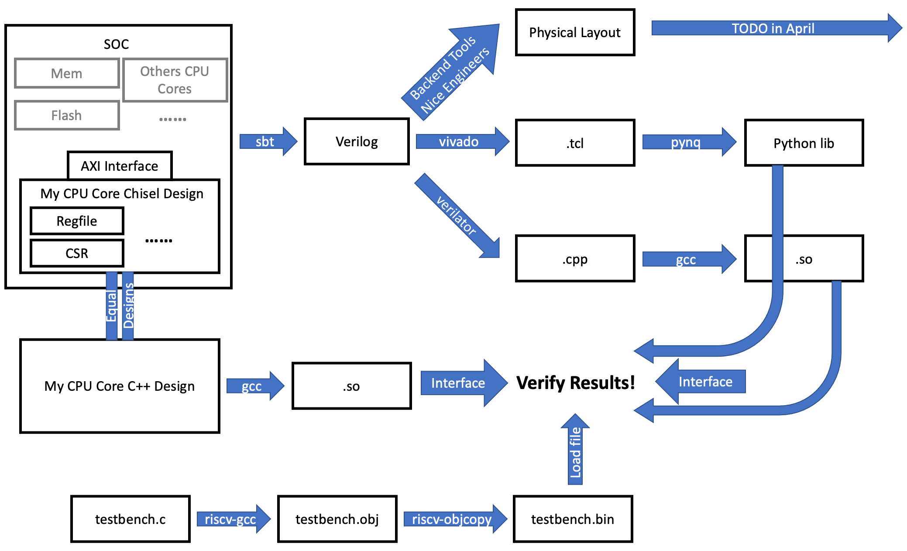

# 一生一芯报告

## 技术指标
处理器核实现RISCV64指令集，支持I、M、和Zicsr拓展，实现Machine态控制寄存器，可以运行RT-thread。

## 微结构设计
整个处理器核的对外接口是clk/rst信号、内存访问AXI4接口、以及MMIO访问AXI4接口。处理器核内部使用5级流水，参考soder，其设计结构如图1。

图1: 微结构设计的结构图

## 微结构实现
在实现过程中，最外层的模块调用了指令数据双接口SRAM-单接口AXI转接桥、SRAM地址空间的MEM-MMIO拆分转接桥、以及一个MEM-MMIO统一SRAM接口的处理器核。

这个内层的处理器核是本微结构实现的核心，它的对外接口是clk/rst信号、SRAM取指接口、SRAM数据读写接口。我们将微结构的五级流水分为5个模块实现，额外增加预取指级来使得实现代码更清晰一致，实现代码结构如图2。图中的箭头线表示了模块的接口，红线标出了五级流水间的主要数据流接口，黑色实线标出了不同逆方向的控制信号反馈（例如，清流水线信号）接口，虚线标出了内存访问接口。

图2: 代码实现的结构图

对于每个模块，我们将独立的功能划分为子模块进行实现，他们有明确定义的功能和接口以方便复用，主要包括：
+ 译码级顶层模块包含一个独立的译码子模块。输入为指令。输出为控制信号。
+ 执行级顶层模块包含一个独立的ALU子模块。输入为操作数和操作码。输出为计算结果，若当拍无法完成运算（如乘除指令），则额外输出stall信号为1。
+ ALU子模块包含一个乘除法模块接口。输入为操作数、操作码、以及数据输入有效位。输出为计算结果，若当拍无法完成运算，则额外输出stall信号为1。

## 验证环境设计
在验证环境中，我们将测试程序在上述硬件实现以及nemu实现上同时运行，并将每一周期的处理器主要状态（PC和寄存器堆）进行对比验证。验证环境结构如图3。
+ 最左一列为硬件chisel代码的编译流程，其接口为SRAM内存接口以及处理器状态输出接口。
+ 次右一列引用了nemu动态库，其接口为内存初始化接口与处理器状态输出接口。
+ 最右一列为测试文件的编译流程。
+ 最后，次左一列的C++文件将其他三部分组合到一起，它一方面读入测试文件到内存数组中，另一方面提供给chisel与nemu接口以将他们接入。为了支持chisel，我们需要用C++实现一个SRAM接口封装在内存数组上，供硬件代码访问，并在每个周期读取处理器状态。为了支持nemu，我们需要使用内存数组对nemu进行初始化，并在每个周期读取处理器状态。

当运行`make`指令时，这些编译依次完成、并运行`runable`程序进行测试。

图3: 验证环境的结构图

值得注意的是，使用C++实现一个内存供硬件代码访问并不是简单的。因为实际上，这一内存的实现要求我们用C++代码实现处理器核逻辑电路模块和内存逻辑电路模块间的信号传输与仿真，而完善的逻辑电路仿真正是verilator实现的功能。在具体实现中，我们可以调用verilator提供的`core.evaluate()`函数对chisel核进行仿真，并获取输入输出，调用我们C++实现的`mem.evaluate()`对内存进行仿真并获取输入输出，最后仔细考虑每个周期内两个模块内的逻辑信号的依赖关系，决定两个模块输入输出的数据传递以及两个模块的仿真顺序。

## 验证结果
我们针对各个技术指标通过了如下测试集：
+ I拓展：riscv64-ui、AMCPUTest
+ M拓展：riscv64-um、AMCPUTest
+ Zicsr拓展和Machine态控制寄存器：RT-thread

在Soc验证中，我的处理器核中的异常指令assert error报错，帮助发现了集成时的一个问题，即，在一个处理器核运行的时候，其他处理器核会从内存成功取回随机指令并执行。

## 其他工作
出于好奇，我们还使用vivado将处理器核封装到了zynq模块中。zynq模块可以直接导入fpga进行运行，并通过zynq模块接口间接对处理器核进行输入输出、和处理器状态输出。pynq开发板进一步将zynq模块封装到了python模块中，因此我们可以直接通过python对处理器核进行输入输出，并对每个周期的处理器状态进行验证。

具体操作为，我们使用vivado图形界面将处理器核`fpgaTOP_0`模块（来自于verilog文件）和vivado的SRAM内存模块封装到`processing_system7_0`模块中，如图4，并将整个设计导出为`.tcl`文件。我们使用pynq上的python库，使用这个`.tcl`文件初始化`Overlay`对象，这样，我们的处理器核最终就被封装成一个python对象。我们接下来只需调用`Overlay`对象的读写函数，就可以对内存和处理器接口进行读写，并导出每个周期的处理器状态进行对比验证。

图4: 将处理器核和SRAM内存封装到vivado的内置zynq模块中

## 总结感悟
我觉得自己最大的收获是对从Soc到riscv核的结构，从chisel语言到verilog、c++仿真、fpga仿真的编译框架，以及硬件设计验证框架有了深入的理解，如图5，并且更重要的是，对图中每一个编译转换的功能、每个模块的接口定义、以及每个模块的实现细节都有所熟悉。

图5: 收获-对硬件开发与验证的框架理解

我觉得在最开始两周我的困惑主要有两个方面：
+ 对各个模块的接口不清楚。导致我不知道要实现什么样的代码，以及一些已有的代码是做什么用的。例如：
  + 处理器核接口不明确：我们很早就提到了串口，但没有提到CPU顶层有MMIO和MEM两个接口，或者要求我们都使用MEM访问，且没有中断。导致我不知道所谓的“实现串口并验证”是指，“让CPU用MMIO接口读写，外部捕捉特定地址输出，并显示成字符，且IO读写不使用中断机制”。
  + nemu接口不明确：刚刚提到要用nemu的时候花了很多时间理解代码并实现指令，但其实如果最开始就明确了nemu的调用接口，可以先把重要的框架搭好，如果有时间在细致去看nemu。
+ 对各个编译工具的输入输出不清楚。导致我不知道我需要的一个预期功能的实现难度有多大。
  + verilator功能不清楚：我对仿真器最初的感觉是会一下子生成一个可执行文件，之后输出波形。并不知道它可以把verilog编译成一个C++库这么方便的得到中间状态。导致我最开始以为获得每个周期的处理器状态会是花很长时间而恐惧。
  + 不知道有riscv-objcopy这个工具：我知道直接编译成的可执行文件肯定不能在verilator里运行，但因为不知道其实加一下这个工具就可以直接在verilator运行。导致我最开始也对在verilator里运行程序很恐惧。

总的来说我希望下一届能够对这些我们要实现/已有的模块的接口、编译工具的输入输出有一个预先的介绍。这样可以把整个项目的重点放在对框架顶层接口的理解与实践上，避免我们在某个具体模块上花过多的时间，导致对整体框架的理解不深入。同时也可以节约大家的时间。